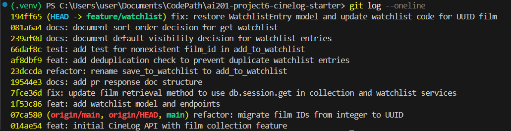

# PR Response Doc — CineLog Watchlist Feature

## AI Usage

<!-- Fill in at the end — how you used AI tools during this project -->

## Comment 1 — Rename

**What I did:** Renamed `save_to_watchlist()` to `add_to_watchlist()` in `watchlist_service.py` to match the project's `verb_to_noun` naming convention (consistent with `add_to_collection()`), and updated all call sites that referenced the old name (routes/tests/etc.).

**How I verified:** Used VSCode's "Rename Symbol" (F2) on the definition in `services/watchlist_service.py`, which updated the one call site in `routes/watchlist.py` (the import line and its use inside `add_film()`). After the rename, I ran a project-wide text search for the old name (`save_to_watchlist`) across the entire repo and confirmed zero remaining occurrences — the definition and its single call site were the only two references, and both now read `add_to_watchlist`.

## Comment 2 — Deduplication

**What I did:** Added deduplication logic to `add_to_watchlist()` in `services/watchlist_service.py`, following the same pattern used in `add_to_collection()` (`services/collection_service.py`). Introduced a new `AlreadyOnWatchlistError` exception (defined locally in `watchlist_service.py`, matching how `AlreadyInCollectionError` is defined locally in `collection_service.py`). Before creating a new `WatchlistEntry`, the function now queries for an existing entry matching `(user_id, film_id)` and raises `AlreadyOnWatchlistError` if one is found. The existing `FilmNotFoundError` check still runs first, unchanged. `get_watchlist()` was not modified, since the comment scoped this change to `add_to_watchlist()` only.

**How I verified:** Compared the new dedup block line-by-line against the equivalent block in `add_to_collection()` to confirm the same query shape (`filter_by(user_id=..., film_id=...).first()`) and control flow (check-then-raise before insert). Confirmed the docstring's `Raises` section was updated to document the new exception.

## Comment 3 — Missing test

**What I did:** Created `tests/test_watchlist.py` and added `test_add_to_watchlist_nonexistent_film_raises`, the watchlist equivalent of `test_add_to_collection_nonexistent_film_raises` in `tests/test_collection.py`. It follows the same fixture and assertion structure: an `app` fixture (in-memory SQLite via `create_app`) and a `sample_user` fixture, then a `pytest.raises(FilmNotFoundError)` block calling `add_to_watchlist()` with a film id that doesn't exist in the database. No `sample_film` fixture is used, matching the reference test, since the case being tested is specifically that the film does _not_ exist.

One deviation from the reference test: I used an integer sentinel (`999999`) for the fake film id instead of a UUID string, since `Film.id` is `db.Integer` in this branch's `models.py`. The original test's UUID-string sentinel appears to be a forward-reference to the main-branch refactor (int → UUID) rather than something that matches this branch's current schema.

**How I verified:** Ran the test directly:

```
pytest tests/test_watchlist.py -v
```

Result: `1 passed in 1.16s`.

## Comment 4 — Default visibility

**My position:** Watchlist entries should default to `public=True`.

**Reasoning:** CineLog is a community film-tracking app — the value of a "watchlist" feature in a social context comes largely from other users being able to see what you're planning to watch, not just what you've already watched. A private-by-default watchlist would make the feature behave like a personal to-do list that happens to live in a shared app, rather than something that feeds the app's social/discovery loop (e.g. seeing that a friend wants to watch a film you also want to watch, or browsing what's trending among people you follow). Defaulting to public also means most users — who won't go out of their way to change a privacy setting — end up participating in that shared layer without extra friction, which is the behavior we want to optimize for: passive, low-effort visibility that makes the community aspect of the app work by default rather than by opt-in.

**Tradeoff acknowledged:** The cost is that some users won't realize their watchlist is visible to others until it already has been — a watchlist can reveal things about someone's taste, mood, or interests (e.g. genre binges, a niche or embarrassing pick) that they didn't consciously choose to share, in a way that's arguably more exposing than a _watched_ list, since it reflects intent rather than a completed, already-public-ish action. A private-by-default approach would avoid that, at the cost of most watchlists sitting invisible and unused as a social feature, since most users don't proactively flip privacy toggles. We're accepting the first risk to avoid the second.

## Comment 5 — Sort order

**My position:** Keeping the current alphabetical sort (`Film.title.asc()`), rather than switching to date-added order.

**Reasoning:** A watchlist isn't a feed you skim once and move past — it's a backlog you return to repeatedly, either to decide what to watch next or to check whether you already added something. Sorting by recency means anything added early keeps sinking further down as the list grows, which works against the actual purpose of a watchlist: not forgetting the things you meant to get to. Alphabetical gives every entry a stable, predictable position regardless of when it was added, so finding something specific doesn't depend on remembering when you added it. That stability matters more here than surfacing "what's new," since the watchlist has no natural endpoint the way a feed does — there's no "caught up" state to optimize for.

**Engagement with reviewer's point:** The recency argument is real for a lot of list UIs, and for many apps, "what did I just add" is the more common question. There's also a consistency argument in the same direction I want to be upfront about even though I'm not adopting it: `get_collection()` already sorts by `date_added.desc()`, so date-added order would make sort behavior match across collection and watchlist. But I'd argue the two lists serve different mental models — collection is a historical log, where chronology _is_ the point (it's a record of when you watched things); watchlist is a working backlog, where findability is the point (it's a record of what you still want to get to). Matching their sort order for consistency's sake would optimize for something neither list actually needs. Given that, I'd rather keep alphabetical here — but I'm glad to revisit if usage shows people mostly care about "what did I just add" rather than "where's the thing I added last month."

## Comment 6 — Rebase

**What conflicted:** `main` had merged a refactor migrating `Film.id` (and all `film_id` foreign keys) from `db.Integer` to `db.String(36)` UUIDs. My `feature/watchlist` branch predated that refactor and still assumed integer film ids throughout — in `models.py` (`WatchlistEntry.film_id`), `watchlist_service.py` and `routes/watchlist.py` (docstrings describing `film_id` as an int), and `tests/test_watchlist.py` (a fake-id sentinel of `999999`).

The rebase itself (`git fetch origin` + `git rebase origin/main`) completed with no conflict markers reported. That turned out to be misleading rather than reassuring: because `WatchlistEntry` was a class that only existed on my branch, git had no equivalent hunk on `main` to conflict against, and the automatic merge of `models.py` silently dropped the `WatchlistEntry` class entirely instead of keeping it alongside the refactored `Film`/`CollectionEntry`. So the real "conflict" wasn't a textual one shown by git — it was a missing class plus a semantic mismatch (int ids vs. the new UUID ids) that I only found by manually diffing the post-rebase files against what I expected, rather than trusting the "successfully rebased" message.

**How I resolved it:**

- Re-added `WatchlistEntry` to `models.py` in its original position, with `film_id` changed from `db.Column(db.Integer, ...)` to `db.Column(db.String(36), db.ForeignKey("film.id"), ...)` to match the refactored `Film.id`.
- Updated the `film_id` docstring in `watchlist_service.py`'s `add_to_watchlist()` from `film_id (int): ID of the film. (Note: integer — pre-refactor)` to `film_id (str): UUID of the film.` No functional code changes were needed there — `db.session.get(Film, film_id)` and the `filter_by(film_id=film_id)` dedup check both work with either type since they just pass the value through; only the documentation was stale.
- Updated the `Body:` docstring comment in `routes/watchlist.py`'s `add_film()` from `{ "film_id": <int> }` to `{ "film_id": <str> }  # UUID`.
- Updated `tests/test_watchlist.py`'s `fake_film_id` from the integer sentinel `999999` to a UUID-shaped string (`"00000000-0000-0000-0000-000000000000"`), matching the sentinel style already used in `test_collection.py`'s equivalent test, since an integer no longer represents a plausible "doesn't exist" id against a UUID-keyed column.

**How I verified no conflict remains:** Ran the full test suite after making these changes:

```
pytest -v
```

All tests passed, including `test_add_to_watchlist_nonexistent_film_raises`. Also confirmed the rebase produced a linear history with no merge commits:

```
git log --oneline --merges
```

returned no output, confirming `feature/watchlist` is a clean rebase onto `origin/main` rather than a merge.

---

## Final Commit History

After rewriting history with `git rebase -i HEAD~9` (rewording two non-conventional commits — `feat: add watchlist model and endpoints` and `refactor: rename save_to_watchlist to add_to_watchlist` — and leaving the rest as-is since each already represented one logical, conventionally-formatted change):

```
git log --oneline
```



All commits above `origin/main` use conventional-commit prefixes (`feat:`, `fix:`, `test:`, `docs:`, `refactor:`), and no merge commits appear anywhere in the log.

## PR Description

<!-- Written at the end — feature overview, design decisions, manual testing steps -->
